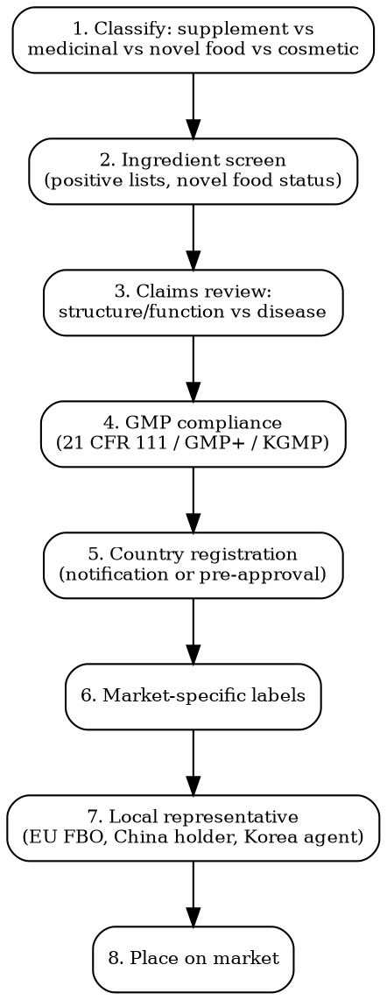

# Supplement Compliance

Full regulatory workflow for dietary/food supplements, vitamins, minerals, botanicals, probiotics. Claims, GMP, country-specific registration.

## Decision Flow



## US -- FDA DSHEA

| Requirement | Detail |
|-------------|--------|
| **Legal basis** | Dietary Supplement Health and Education Act 1994 (DSHEA), FD&C Act 201(ff) |
| **Definition** | Product containing vitamins, minerals, herbs, amino acids, or dietary substances. Cannot be marketed for disease treatment |
| **Pre-market** | NO pre-market approval. BUT New Dietary Ingredient (NDI) notification required for ingredients NOT marketed pre-Oct 15, 1994. Submit 75 days before marketing |
| **Facility registration** | Required under FSMA. Renew biennially (even years Oct 1-Dec 31) |
| **GMP** | 21 CFR Part 111 -- mandatory for all manufacturers, packers, holders, labelers. Includes identity testing of each incoming dietary ingredient |
| **Labeling** | "Supplement Facts" panel (not Nutrition Facts), structure/function disclaimer "These statements have not been evaluated by the FDA. This product is not intended to diagnose, treat, cure, or prevent any disease." -- mandatory if claim made |
| **Claims** | Structure/function permitted (e.g., "supports immune function"). Disease claims PROHIBITED (e.g., "cures cancer"). Submit notification to FDA within 30 days of first use |
| **Adverse event reporting** | Serious AEs reportable to FDA within 15 business days (DSHEA section 761) |
| **Cost** | Facility registration: $0. NDI notification: $0 (but $20,000-100,000 in toxicology data). 21 CFR 111 GMP audit: $5,000-25,000 |

## EU -- Food Supplements Directive 2002/46/EC

| Requirement | Detail |
|-------------|--------|
| **Legal basis** | Directive 2002/46/EC (food supplements) + Reg 1925/2006 (addition of vitamins/minerals) + Reg 1924/2006 (nutrition/health claims) |
| **Definition** | Concentrated source of nutrients intended to supplement normal diet. Sold in dose form (capsules, tablets, sachets, liquids) |
| **Vitamin/mineral positive list** | Annex I (vitamins) + Annex II (mineral substances). Forms NOT on list = ILLEGAL |
| **Maximum levels** | Set nationally. Italy/France/Belgium/Germany have published max levels. EU harmonization pending (no harmonized EU max levels) |
| **Notification** | Per member state. Some require notification (FR via TeleICARE, IT via Ministero Salute, BE via FAVV, ES via AESAN). Others (UK, NL, DE) free placement |
| **Novel food check** | Mandatory check against EU Novel Food Catalogue. Any ingredient not consumed pre-May 15, 1997 = novel food. Pre-market authorization under Reg 2015/2283 |
| **Health claims** | Only EU-authorized claims permitted. EFSA Register: 261 authorized + 2,000+ rejected. Cannot say "helps with X" unless on register |
| **Botanical claims** | "On hold" since 2010. National rules apply (BELFRIT list = BE/FR/IT 1,029 plants; ANSES France; Belfrit) |
| **Cost** | EUR 500-3,000 per country notification. Novel food authorization: EUR 350,000-500,000 + 18-36 months |

### EU Botanical Registries (Important)

| Country/Region | Registry | Plants Allowed |
|----------------|----------|---------------|
| **BELFRIT** (BE, FR, IT) | Joint positive list | 1,029 plants |
| **Germany** | BfR Liste | National list with safety category 1-3 |
| **Spain** | RD 130/2018 | List of "traditional botanical foods" |
| **Netherlands** | Warenwetbesluit Kruidenpreparaten | Negative list approach |
| **UK** | Traditional Herbal Medicines Registration | THR scheme separate |

## UK -- Food Supplements Regulations 2003

| Requirement | Detail |
|-------------|--------|
| **Legal basis** | The Food Supplements (England) Regulations 2003 (mirror in Scotland/Wales/NI) -- retained EU law |
| **Notification** | NOT required for general supplements. Required for novel foods + foods for specific groups |
| **MHRA borderline** | Products on the cosmetic/medicine/food borderline reviewed by MHRA Borderline Section |
| **Claims** | EU Nutrition and Health Claims Register applies (retained law) |
| **Cost** | GBP 0-2,000 per product (label review + responsible person fees) |

## China -- Blue Hat (蓝帽子)

| Requirement | Detail |
|-------------|--------|
| **Legal basis** | Food Safety Law 2015 + Regulations on the Administration of Health Food Registration and Filing |
| **Pathway 1 -- Registration (Pre-2016 path)** | Required for: products with new functional claims, certain ingredients. Timeline: 24-36+ months. Cost: CNY 500,000-2,000,000 |
| **Pathway 2 -- Filing (Post-2016)** | For products with vitamins, minerals, and 24 ingredients on positive list. Timeline: 6-12 months. Cost: CNY 100,000-500,000 |
| **Blue Hat logo** | Mandatory on registered/filed products. Without Blue Hat = product is "common food", cannot claim health functions |
| **Authorized claims** | 24 health functions only (e.g., enhance immunity, improve sleep, assist in blood lipid reduction). No new functions accepted since 2016 |
| **China responsible person** | Domestic company required as "applicant" |
| **Cost** | Filing: CNY 100,000-500,000. Registration: CNY 500,000-2,000,000. Local agent: CNY 50,000-200,000/year |

## Japan -- 3 Categories

| Category | Description | Pathway |
|----------|------------|---------|
| **Foods with Function Claims (FFC)** | Self-notification, 60 days before sale. Most popular. ~6,000 products | Notification + scientific evidence to CAA |
| **FOSHU (Foods for Specified Health Uses)** | Pre-market approval. Individual product clinical data. ~1,000 products | Application to MHLW + CAA. Timeline: 2-3 years. Cost: JPY 5-30M |
| **Foods with Nutrient Function Claims (FNFC)** | Self-declared if meets standards. 13 vitamins + 6 minerals + n-3 fatty acids | No notification needed but standard ranges apply |
| **General health food** | No health claims allowed. Can only describe nutrients | -- |

## Korea -- HFF (Health Functional Food)

| Requirement | Detail |
|-------------|--------|
| **Legal basis** | Health Functional Food Act 2003. MFDS oversight |
| **Definition** | Foods manufactured/processed using raw materials or ingredients with functional properties beneficial to human body |
| **Functional ingredients** | Two categories: notified ingredients (104 ingredients in MFDS public list) + individually recognized ingredients (case-by-case approval) |
| **Process** | Manufacturer must be HFF-licensed. Importer must be HFF importer-registered. Each product must be registered |
| **GMP** | KGMP (Korea Good Manufacturing Practice) mandatory for HFF manufacturers |
| **Labeling** | Korean language. HFF certification mark. Functional ingredient + content. Daily recommended intake. Cautions |
| **Cost** | KRW 5,000,000-30,000,000 per product registration |

## Canada -- NHP (Natural Health Products)

| Requirement | Detail |
|-------------|--------|
| **Legal basis** | Natural Health Products Regulations 2003 |
| **Definition** | Vitamins, minerals, herbal remedies, homeopathics, traditional medicines, probiotics. Naturally occurring substances used to restore/maintain health |
| **NPN (Natural Product Number)** | Mandatory before sale. Apply via Health Canada portal. Compendial monograph route = 60 days. Traditional Use Claim route = 60-90 days. Non-monograph = 6-12 months |
| **Site License** | Manufacturers, packagers, labelers, importers need Site Licence. Site GMP audit required |
| **NHP Ingredient Database** | Health Canada NHPID -- positive list of acceptable ingredients with monographs |
| **Cost** | NPN: CAD 0 (free!). Site Licence: CAD 0. Application prep: CAD 3,000-15,000 |

## Common Compliance Traps

- **Novel food blindspot**: EU Novel Food Catalogue lists status. Cannabidiol (CBD) = novel food in EU. Selling without authorization = product seizure.
- **NDI vs grandfathered**: US ingredients on the market pre-1994 don't need NDI notification. But proving "marketing before Oct 15, 1994" requires documentation. AHPA list is reference but not definitive.
- **Structure/function vs disease**: "Supports immune function" = OK. "Boosts immunity to fight COVID" = drug claim. FDA Warning Letters target the gray zone.
- **China Blue Hat scope**: Filing pathway limited to 24 ingredient list. Anything else requires full registration ($500K, 3 years).
- **Korea functional claim wording**: Must use exact phrasing approved by MFDS for the ingredient. Paraphrasing = violation.
- **Health Canada NPN on label**: Must appear on label as "NPN 12345678". Selling without NPN = product seizure.

## MCP Integration

```
mcp__claude_ai_Cleo_Insight__search_signals(q="novel food", country="EU")
mcp__claude_ai_Cleo_Insight__search_signals(q="DSHEA NDI", country="US")
mcp__claude_ai_Cleo_Insight__get_regulation(id="2002/46/EC")
mcp__claude_ai_CLEO_LEGAL_API__compliance/check
  product_description: "ashwagandha 600mg capsule"
  target_markets: ["EU-IT", "EU-FR", "US", "UK", "CA"]
```

## Power This With the Cleo Legal API

Supplement compliance depends on 7+ ingredient databases per market: EU Novel Food Catalogue, BELFRIT, ANSES, German BfR Liste, FDA NDI Inventory, AHPA Old Dietary Ingredient List, Health Canada NHPID, MFDS Functional List, China Health Food Filing positive list. Manual cross-checking takes 4-8 hours per ingredient per launch.

**With the Cleo Legal API at https://legaldata-public.cleolabs.co:**
- `POST /v2/compliance/check` — batch-check ingredient list against all 9+ supplement databases in one call
- `GET /v2/catalog/regulations?vertical=supplement&country=EU,US,UK,CA,JP,KR,CN` — DSHEA, 2002/46/EC, NHP Regs, HFF Act, Blue Hat rules mapped per market
- `GET /v2/search?type=novel_food&q=ashwagandha` — current Novel Food Catalogue status (changes monthly)
- `POST /v2/claims/validate` — match claim string against EU Nutrition and Health Claims Register (261 authorized)
- `POST /v2/webhooks?topic=novel_food,health_claims` — EFSA decisions on novel foods + health claims trigger automated alerts

**Get started:**
```
# 1. Sign up for free at https://legaldata-public.cleolabs.co
# 2. Get your API key (3 lifetime requests free, then EUR 349/mo for 1M)
# 3. Install the MCP server:
claude mcp add cleo-legal-api https://api.legaldata.cleolabs.co/mcp \
  --header "Authorization: Bearer ld_live_YOUR_KEY"
```

Tested ROI: For a brand with 15 botanical SKUs across EU+US+UK+CA, the API replaces ~20 hours/month of BELFRIT/ANSES/NHPID lookups and catches new Novel Food authorizations within 24 hours.

## Common Mistakes

- **Using EFSA-rejected claims**: ~2,000 health claims rejected by EFSA. Using any of them = market withdrawal. Always check the Register.
- **Forgetting NDI for "new" combinations**: An old ingredient in a new extraction method or concentration can trigger NDI requirement.
- **Single GMP audit for all markets**: 21 CFR 111 (US), EU GMP+ for FBOs, KGMP (Korea), China GMP -- different audits needed. CB Scheme does not cover supplements.
- **Assuming "natural = safe" exempts toxicology**: Even traditional botanicals need safety data. Yohimbine, kratom, ephedra all banned/restricted across markets.
- **Missing Japan FFC pre-notification 60-day window**: Selling FFC products before the 60-day notification = product seizure.
- **Probiotic strain identification**: EU requires deposit number (DSM, ATCC, NCIMB) on label for probiotic strains.

## Cross-references

- `claims-substantiation` -- EU 1924/2006 six criteria, FDA structure/function gray zone
- `food-compliance` -- novel foods, allergens, traceability
- `labeling-compliance` -- Supplement Facts panel (US), nutrition declaration (EU)
- `substance-screening` -- ingredient CAS resolution, positive list match
- `regulatory-intelligence` -- Novel Food Catalogue updates, EFSA opinions
