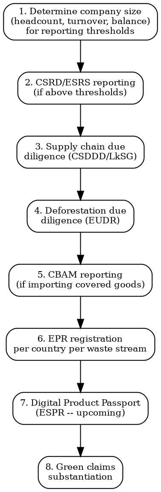

# Sustainability Compliance

Mandatory environmental and sustainability obligations for physical product companies. Not voluntary CSR -- these are enforceable laws with fines.

## Decision Flow



## CSRD / ESRS -- Sustainability Reporting

| Aspect | Detail |
|--------|--------|
| **Regulation** | Corporate Sustainability Reporting Directive (EU) 2022/2464. Reporting standards: ESRS (European Sustainability Reporting Standards) |
| **Who must report** | Phase 1 (FY 2024, report 2025): Large public-interest entities >500 employees (already under NFRD). Phase 2 (FY 2025, report 2026): All large companies (2 of 3: >250 employees, >EUR 50M turnover, >EUR 25M balance sheet). Phase 3 (FY 2026, report 2027): Listed SMEs (opt-out possible until 2028). Non-EU companies with >EUR 150M EU turnover: FY 2028 |
| **What to report** | Double materiality assessment + ESRS topical standards: E1 (climate), E2 (pollution), E3 (water), E4 (biodiversity), E5 (circular economy), S1-S4 (social), G1 (governance) |
| **Assurance** | Limited assurance required (moving to reasonable assurance by 2028) |
| **Penalties** | Member state-specific. Fines + director liability for non-compliance |
| **SME impact** | Even if below thresholds, large customers will request data for their own CSRD reports (value chain data). Prepare voluntarily |

## CSDDD -- Corporate Sustainability Due Diligence Directive

| Aspect | Detail |
|--------|--------|
| **Regulation** | Directive (EU) 2024/1760 |
| **Who** | Phase 1 (2027): >5,000 employees + >EUR 1.5B global turnover. Phase 2 (2028): >3,000 employees + >EUR 900M. Phase 3 (2029): >1,000 employees + >EUR 450M. Non-EU companies with >EUR 450M EU turnover (2029) |
| **Obligations** | Identify + assess actual/potential adverse human rights and environmental impacts in own operations + subsidiaries + value chain. Prevent, mitigate, bring to an end. Complaint mechanism. Public reporting |
| **Climate transition plan** | Mandatory adoption aligned with Paris 1.5C |
| **Penalties** | Up to 5% of net worldwide turnover. Civil liability for damage |
| **SME impact** | SMEs exempted from direct scope but will be pressured by in-scope customers as part of their value chain due diligence |

### German Supply Chain Act (LkSG) -- Already in Force

| Aspect | Detail |
|--------|--------|
| **In force since** | Jan 2023 (>3,000 employees), Jan 2024 (>1,000 employees) |
| **Scope** | German companies + companies with German branch. Direct suppliers mandatory; indirect if substantiated knowledge of violation |
| **Obligations** | Risk analysis, prevention, remediation, complaint mechanism, documentation, annual report |
| **Enforcement** | BAFA (Federal Office for Economic Affairs and Export Control). Fines up to 2% of global turnover |
| **Relation to CSDDD** | LkSG will be superseded by CSDDD transposition (expected 2026-2027) |

## EUDR -- Deforestation Regulation

| Aspect | Detail |
|--------|--------|
| **Regulation** | (EU) 2023/1115 |
| **Commodities** | Cattle (leather, beef), cocoa, coffee, oil palm, rubber, soya, wood. Plus derived products (chocolate, furniture, tires, printed paper, charcoal, cosmetics with palm oil) |
| **Obligation** | Due diligence: products must be deforestation-free (cut-off date: Dec 31, 2020) + legal in country of production. Geolocation data of production plots required |
| **Timeline** | Large operators: Dec 30, 2025 (delayed from Jun 2025). SMEs: Jun 30, 2026 |
| **Due diligence** | Collect geolocation data -> risk assessment (country benchmarking) -> risk mitigation -> due diligence statement per shipment in EU information system |
| **Penalties** | Fines proportionate to environmental damage + turnover. Confiscation of products. Temporary exclusion from public procurement |
| **Physical product impact** | If your product contains palm oil (cosmetics, food), cocoa (food), leather (fashion, accessories), rubber (footwear), wood (packaging, furniture) -- you must comply |

## CBAM -- Carbon Border Adjustment Mechanism

| Aspect | Detail |
|--------|--------|
| **Regulation** | (EU) 2023/956 |
| **Scope** | Imports of: cement, iron/steel, aluminium, fertilisers, electricity, hydrogen. Extended scope under review |
| **Transitional period** | Oct 2023 - Dec 2025: Quarterly reporting of embedded emissions (no financial adjustment) |
| **Definitive period** | Jan 2026: Must purchase CBAM certificates corresponding to embedded emissions at EU ETS carbon price |
| **Who** | EU importers of covered goods. Must be authorized CBAM declarant |
| **Physical product relevance** | Directly applicable if importing steel/aluminium components (electronics housings, appliance bodies, fasteners). Indirectly increases supply chain costs |

## EPR -- Extended Producer Responsibility

**You must register as a producer in EVERY EU member state where you sell, for EACH waste stream.**

### Packaging EPR

| Country | PRO (Producer Responsibility Organization) | Annual Cost Estimate |
|---------|---------------------------------------------|---------------------|
| France | Citeo | EUR 300-5,000 (depends on volume and material) |
| Germany | Zentrale Stelle Verpackungsregister (LUCID) | EUR 200-3,000 + dual system contract |
| Italy | CONAI | EUR 200-2,000 |
| Spain | Ecoembes (packaging) | EUR 200-2,000 |
| UK | Environment Agency (packaging EPR reform 2025) | GBP 500-5,000 (new fees under reform) |
| Netherlands | Afvalfonds Verpakkingen | EUR 200-1,500 |

**Germany LUCID registration is mandatory before first sale**. Must register, then contract with a dual system (e.g., Der Grune Punkt, Interseroh, Reclay).

### Other EPR Streams

| Waste Stream | EU Regulation | Key Markets |
|-------------|--------------|-------------|
| **Batteries** | EU Battery Regulation 2023/1542 | Per-country registration. Collection targets + recycling efficiency |
| **WEEE** | Directive 2012/19/EU | Per-country registration (see electronics-compliance skill) |
| **Textiles** | Being introduced under ESPR + member state laws | France (already mandatory via Refashion), others phasing in 2025-2027 |

## French Loi AGEC (Anti-Waste Law)

| Obligation | Detail | Deadline |
|------------|--------|----------|
| **Repairability index** | Mandatory score (0-10) displayed at point of sale for: smartphones, laptops, TVs, washing machines, lawnmowers, power tools, dishwashers, vacuum cleaners, printers | In force since Jan 2021 (expanding) |
| **Durability index** | Replacing repairability index with broader durability score | 2025-2026 (phased by category) |
| **Anti-destruction of unsold goods** | Banned for non-food products | In force since Jan 2022 (clothing/electronics) |
| **Single-use plastic bans** | Progressive bans on single-use plastic items | Multiple phases 2021-2025 |
| **Triman marking** | Products subject to EPR must display Triman logo + sorting instructions | In force since Jan 2022 (packaging), expanding to all EPR streams |

## Ecodesign for Sustainable Products Regulation (ESPR) -- Digital Product Passport

| Aspect | Detail |
|--------|--------|
| **Regulation** | (EU) 2024/1781 |
| **Scope** | All physical products on EU market (except food, feed, medicinal products). Priority categories via delegated acts |
| **Digital Product Passport** | Unique product identifier linked to data carrier (QR code). Contains: materials, origin, carbon footprint, repairability score, recycled content, compliance declarations |
| **First delegated acts** | Expected 2025-2026 for textiles, electronics, batteries (already covered), furniture, iron/steel |
| **DPP operational** | Estimated 2027-2030 depending on product category |
| **Unsold goods destruction** | Ban (already applies to textiles and electronics under Loi AGEC in France; ESPR extends EU-wide) |

## Green Claims Directive (Proposed)

| Aspect | Detail |
|--------|--------|
| **Status** | Proposed March 2023. Expected adoption 2025-2026 |
| **Scope** | ALL voluntary environmental claims ("eco-friendly", "carbon neutral", "biodegradable", "sustainable", "green", "ocean-friendly") |
| **Requirements** | Claims must be: based on recognized scientific evidence, relate to entire lifecycle, specify if claim is about product/part/packaging/company, verified by independent third party |
| **Banned** | Generic environmental claims without substantiation. Environmental labels not based on approved certification schemes |
| **Penalties** | Member state fines + consumer right to remedies |
| **Action now** | Audit all marketing materials, website, packaging for environmental claims. Remove unsubstantiated claims. Prepare evidence files for remaining claims |

## Voluntary Frameworks (Market-Expected)

| Framework | What It Is | When Relevant |
|-----------|-----------|---------------|
| **B Corp** | Holistic company certification (governance, workers, community, environment, customers). BIA assessment >=80 points | Brand positioning, investor expectations |
| **SBTi** | Science Based Targets initiative. Validated GHG reduction targets aligned with Paris Agreement | Supply chain requirements from large buyers |
| **GRI** | Global Reporting Initiative. Sustainability reporting standards | Often used alongside or instead of ESRS for non-EU reporting |
| **CDP** | Carbon Disclosure Project. Annual climate/water/forests questionnaire | Investor requests, supply chain programs (>680 buying organizations request CDP data) |

## MCP Integration

```
# Monitor sustainability regulation changes:
mcp__claude_ai_Cleo_Insight__search_signals
  query: "sustainability regulation CSRD EUDR ESPR"

# Track specific regulation status:
mcp__claude_ai_Cleo_Insight__list_regulations
  # Filter for sustainability-related

# Check ISO 27001 compliance (if handling customer data alongside products):
mcp__bastion__get-frameworks-stats
```

## Common Mistakes

- **Ignoring EPR as a non-EU company**: If you sell into the EU (including via marketplace), YOU are the producer for EPR purposes. Register or appoint an Authorized Representative.
- **CSRD as "not my problem" (SME)**: Large customers will request your data for their CSRD reporting. Non-response = lost contract. Prepare data voluntarily.
- **"Carbon neutral" claims without substantiation**: The EU Green Claims Directive will ban generic environmental claims. "Carbon neutral" based only on offsets is already under legal challenge in multiple member states.
- **EUDR geolocation data**: Not just "country of origin." You need GPS coordinates of the production plot for applicable commodities. Start mapping your supply chain now.
- **Germany LUCID before marketplace listing**: Amazon Germany requires LUCID registration number before listing. No LUCID = listing blocked.
- **Treating EPR as one-time**: EPR requires annual reporting of quantities placed on market, per material type, per country. It is an ongoing obligation.
