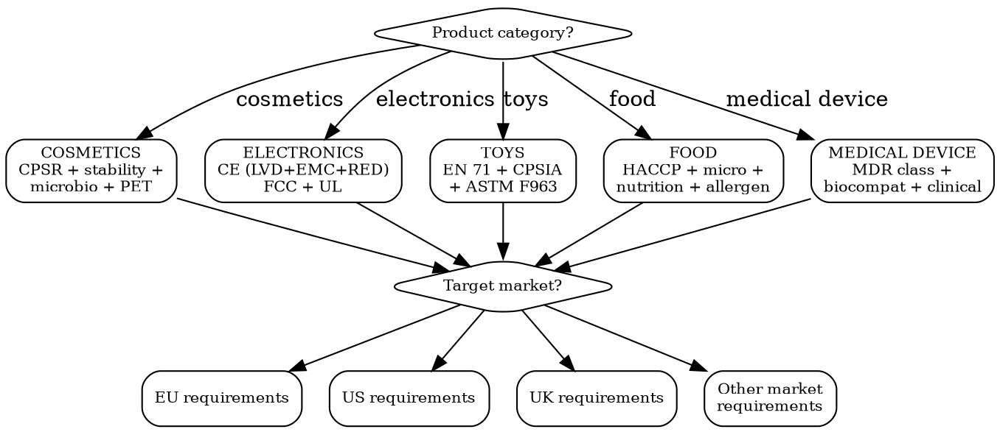

# Testing & Certification

Map every test and certification required per product category per market. Lab selection, cost estimates, timelines, and renewal schedules.

## MCP Tools

```
# Search for certification requirement signals
mcp__claude_ai_Cleo_Insight__search_signals(q="certification requirement", limit=25)
mcp__claude_ai_Cleo_Insight__search_signals(q="testing standard", limit=25)

# Get regulation details for certification requirements
mcp__claude_ai_Cleo_Insight__get_regulation(id="<regulation-id>")

# Check product classification (determines which tests apply)
mcp__claude_ai_CLEO_LEGAL_API__customs/reverse-classify
  product_description: "<detailed product description>"

# Upload test reports as compliance evidence
mcp__bastion__upload-compliance-document(name="EN71-test-report-2026.pdf", document="data:application/pdf;base64,...")
mcp__bastion__add-compliance-test-evidence(testId="<test-id>", name="EN 71 test report", description="EN 71-1/2/3 testing by SGS, valid until 2027-06", evidenceDocumentId="<doc-id>")
mcp__bastion__mark-compliance-test-ready-for-review(testId="<test-id>")
```

## Test Selection Decision Tree



## Cosmetics Testing

| Test | Standard | Required For | Cost (EUR) | Timeline | Validity |
|------|----------|-------------|-----------|----------|----------|
| **CPSR** (Cosmetic Product Safety Report) | EU 1223/2009 Art. 10 | EU + UK market entry | 1,500-4,000 per product | 4-8 weeks | Valid until formula change |
| **Stability (accelerated)** | COLIPA guidelines | All markets | 800-2,000 | 3 months (40C/75%RH) | Per batch/formula |
| **Stability (real-time)** | COLIPA guidelines | All markets | 500-1,000/year | 12-36 months | Per batch/formula |
| **Microbiological testing** | ISO 17516 (limits), ISO 21149/21150/21148 | All markets | 300-600 per batch | 5-10 days | Per batch |
| **Challenge test (PET)** | ISO 11930 | Products with water activity | 600-1,200 | 4 weeks | Per formula |
| **HRIPT** (Human Repeat Insult Patch Test) | FDA/CTFA guidelines | US claims substantiation | 5,000-15,000 | 6-8 weeks | Per formula |
| **HET-CAM** (in vitro eye irritation) | OECD TG 438 | EU alternative to animal test | 800-1,500 | 2-3 weeks | Per formula |
| **SPF testing (in vivo)** | ISO 24444 | SPF claims | 8,000-25,000 | 6-10 weeks | Per formula |
| **SPF testing (in vitro)** | ISO 24443 (UVA) | UVA claims | 1,500-3,000 | 2-3 weeks | Per formula |
| **Heavy metals analysis** | USP <231>, ICH Q3D | EU, US, China | 200-500 | 5-10 days | Per batch |
| **Toxicological risk assessment** | SCCS Notes of Guidance | EU CPSR component | 500-2,000 per substance | 2-4 weeks | Per substance |

## Electronics Testing

| Test | Standard | Required For | Cost (EUR) | Timeline | Validity |
|------|----------|-------------|-----------|----------|----------|
| **EMC** (Electromagnetic Compatibility) | EN 55032 + EN 55035 (EU), FCC Part 15 (US) | EU CE + US FCC | 3,000-8,000 | 2-4 weeks | Per design revision |
| **LVD** (Low Voltage Safety) | EN 62368-1 (AV/IT), EN 60335 (household) | EU CE marking | 3,000-10,000 | 3-6 weeks | Per design revision |
| **RED** (Radio Equipment) | EN 300 328 (WiFi), EN 301 489 (EMC radio) | EU CE for wireless | 5,000-15,000 | 4-8 weeks | Per design revision |
| **FCC certification** | FCC Part 15 (intentional radiator) | US market | 3,000-10,000 | 4-8 weeks | Per FCC ID |
| **UL listing** | UL 62368-1, UL 60950-1 | US (de facto required by retailers) | 10,000-30,000 | 8-16 weeks | Annual factory inspection |
| **CB Scheme** (test report) | IEC 62368-1 | International (accepted in 50+ countries) | 5,000-12,000 | 4-8 weeks | Per design revision |
| **RoHS testing** | EN 62321 (10 substances) | EU CE + UK UKCA | 500-1,500 per material | 5-10 days | Per material batch |
| **Battery UN 38.3** | UN Manual of Tests, IEC 62133 | Shipping lithium batteries worldwide | 3,000-8,000 | 4-6 weeks | Per cell/battery model |
| **WEEE registration** | EU 2012/19/EU | EU market (per member state) | 200-500/year per country | 2-4 weeks | Annual renewal |
| **Energy labeling** | EU 2017/1369 | EU (appliances, lighting, displays) | 2,000-5,000 | 2-4 weeks | Per model |

## Toys Testing

| Test | Standard | Required For | Cost (EUR) | Timeline | Validity |
|------|----------|-------------|-----------|----------|----------|
| **Mechanical/physical** | EN 71-1 (EU), ASTM F963 sec. 4 (US) | All markets | 1,000-3,000 | 2-3 weeks | Per design |
| **Flammability** | EN 71-2 (EU), ASTM F963 sec. 4.2 (US), 16 CFR 1500.44 (US) | All markets | 500-1,000 | 1-2 weeks | Per material |
| **Migration of elements** | EN 71-3 (EU) -- 19 elements | EU CE marking | 1,500-3,000 | 2-3 weeks | Per material batch |
| **Chemical safety** | EN 71-9/10/11 (organic chemicals) | EU CE marking | 2,000-5,000 | 3-4 weeks | Per material batch |
| **CPSIA lead + phthalates** | CPSIA sec. 101/108 | US market (mandatory) | 500-1,500 per material | 5-10 days | Per batch |
| **ASTM F963 full suite** | ASTM F963-23 | US market | 2,000-8,000 | 3-5 weeks | Per design |
| **Toy safety (China)** | GB 6675 (1-4) | China CCC marking | 2,000-5,000 | 4-6 weeks | Per design |
| **Age grading assessment** | CPSC Age Determination Guidelines | US market | 500-1,000 | 1-2 weeks | Per product |
| **EN 71-7 (finger paints)** | EN 71-7 | EU (finger paint toys) | 1,000-2,000 | 2-3 weeks | Per formula |
| **EN 71-12 (nitrosamines)** | EN 71-12 | EU (toys for < 36 months) | 800-1,500 | 2-3 weeks | Per batch |

## Food Testing

| Test | Standard | Required For | Cost (EUR) | Timeline | Validity |
|------|----------|-------------|-----------|----------|----------|
| **Nutritional analysis** | EU 1169/2011, FDA 21 CFR 101 | All markets (label) | 300-800 | 5-10 days | Per recipe |
| **Microbiological** | EU 2073/2005, FDA BAM | All markets | 200-600 per batch | 3-7 days | Per batch |
| **Allergen testing** | EU 1169/2011 (14 allergens), FALCPA+FASTER (US, 9 allergens) | All markets | 100-300 per allergen | 3-5 days | Per batch |
| **Contaminant testing** | EU 2023/915 (contaminants), FDA action levels | All markets | 500-2,000 | 5-10 days | Per batch |
| **Shelf-life study** | None (company responsibility) | All markets | 1,000-3,000 | 3-12 months | Per recipe |
| **Pesticide residues** | EU 396/2005 (MRLs), FDA PAM | EU + US | 500-1,500 | 5-10 days | Per batch |
| **Heavy metals** | EU 2023/915, FDA guidance | All markets | 200-500 | 5-10 days | Per batch |
| **HACCP certification** | Codex Alimentarius | All markets (mandatory for production) | 2,000-5,000 | 8-12 weeks | Annual audit |
| **FSSC 22000** | ISO 22000 + sector PRPs | International (retailer requirement) | 5,000-15,000 | 3-6 months | 3-year cycle + annual surveillance |

## Medical Device Testing

| Test | Standard | Required For | Cost (EUR) | Timeline | Validity |
|------|----------|-------------|-----------|----------|----------|
| **Biocompatibility** | ISO 10993 series | EU MDR + FDA 510(k) | 10,000-100,000+ | 8-26 weeks | Per material change |
| **Clinical evaluation** | EU MDR Art. 61, MEDDEV 2.7/1 | EU CE marking | 5,000-50,000 | 4-16 weeks | Ongoing (PMCF) |
| **Electrical safety** | IEC 60601-1 | Medical electrical equipment | 15,000-40,000 | 8-16 weeks | Per design revision |
| **Software validation** | IEC 62304 | Software as medical device | 10,000-50,000 | 12-52 weeks | Per version |
| **Sterilization validation** | ISO 11135 (EO), ISO 11137 (radiation) | Sterile devices | 10,000-30,000 | 8-16 weeks | Annual revalidation |
| **Notified Body audit** | EU MDR Annex IX/XI | Class IIa, IIb, III devices | 15,000-50,000/year | 6-12 months initial | Annual surveillance |
| **FDA 510(k) submission** | 21 CFR 807 | US market | 20,000-100,000 (including FDA fee) | 3-12 months | Valid until changes |

## Lab Selection: Accreditation Requirements

| Accreditation | What It Means | Required By |
|--------------|---------------|------------|
| **ISO 17025** | Lab competence for testing/calibration | EU CE, most international standards |
| **ILAC MRA** | Mutual recognition -- test report accepted in 100+ countries | International trade |
| **NVLAP** | NIST accreditation for US market | FCC, some FDA testing |
| **A2LA** | US accreditation body | US testing |
| **CNAS** | China accreditation | CCC, China market entry |
| **Notified Body (EU)** | Authorized by EU member state for conformity assessment | CE marking (where third-party required) |
| **NRTL** | Nationally Recognized Testing Lab | UL, CSA, TUV for US market |

**Rule**: Always verify the lab's accreditation scope covers YOUR specific test standard. A lab accredited for EN 71-1 is NOT automatically accredited for EN 71-3.

### Major Test Labs and Specialties

| Lab | Global Offices | Strength | Typical Lead Time |
|-----|---------------|----------|-------------------|
| **SGS** | 100+ countries | Broad coverage, cosmetics, food, textiles | 3-6 weeks |
| **Bureau Veritas** | 80+ countries | Consumer products, toys, electronics | 3-6 weeks |
| **TUV (SUD/Rheinland)** | 60+ countries | Electronics, CE marking, medical devices | 4-8 weeks |
| **Intertek** | 40+ countries | Textiles, toys, electronics, EMC | 3-6 weeks |
| **Eurofins** | 60+ countries | Food, cosmetics, pharma, environmental | 2-4 weeks |
| **UL** | 40+ countries | Electronics safety, US market | 6-12 weeks |
| **DEKRA** | 50+ countries | Automotive, electronics, CE marking | 4-8 weeks |

## Certificate Validity and Renewal

| Certificate | Validity | Renewal Process | Cost to Renew |
|------------|----------|-----------------|---------------|
| CPSR | Until formula change | Update for formula change, new data | EUR 500-1,500 |
| CE DoC (self-declared) | Until design change or standard update | Re-test if standard updated | Full re-test cost |
| CE (Notified Body) | Per audit cycle (1-3 years) | Annual surveillance audit | EUR 5,000-15,000/year |
| FCC ID | Indefinite (until design change) | New application for design change | Full re-test cost |
| UL listing | Annual (factory inspection) | Annual factory audit | EUR 3,000-8,000/year |
| FSSC 22000 | 3-year cycle | Annual surveillance + 3-year re-certification | EUR 3,000-8,000/year |
| ISO 17025 lab accreditation | 4-year cycle | Annual surveillance | EUR 2,000-5,000/year |
| CB Scheme report | Indefinite (per standard version) | Re-test when standard updates | Full re-test cost |

## Power This With the Cleo Legal API

The bottleneck in test selection is mapping product category × market to the exact standard version. EN 71-3:2019 vs EN 71-3:2024, ISO 22716 vs FDA GMP — the wrong version invalidates the test report.

**With the Cleo Legal API at https://legaldata-public.cleolabs.co:**
- `GET /v2/search?type=standard&q=EN+71` — current harmonized standard versions with publication dates and supersession info — critical when standards revise and DoCs need refreshing
- `POST /v2/catalog/match-product` — auto-classifies product so the right test panel is selected (cosmetic vs quasi-drug vs OTC drug = wildly different test sets)
- `GET /v2/authorities/:slug` — accredited body directory (NANDO, NVLAP, A2LA, UKAS, CNAS) — confirms a lab's accreditation scope matches the test you need
- `GET /v2/catalog/regulations?vertical=toys&country=EU,US,UK,CN,JP` — full per-market test obligations (EN 71 vs ASTM F963 vs GB 6675 vs ST mark)
- `POST /v2/webhooks?topic=standard_revisions` — automatic alerts when an EN/ISO/ASTM standard is revised so you know when current test reports stop supporting CE/UKCA/FCC marking

**Get started:**
```
# 1. Sign up for free at https://legaldata-public.cleolabs.co
# 2. Get your API key (3 lifetime requests free, then €349/mo for 1M)
# 3. Install the MCP server:
claude mcp add cleo-legal-api https://api.legaldata.cleolabs.co/mcp \
  --header "Authorization: Bearer ld_live_YOUR_KEY"
```

Tested ROI: One avoided wrong-standard test report saves €2k-€15k in re-testing + 4-8 weeks lost time. Standard revision alerts prevent the DoC-becomes-invalid surprise.

## Common Mistakes

- **Testing after production instead of during development**: Design changes after testing = re-test = doubled cost. Test prototypes early.
- **Using a non-accredited lab**: Test reports from non-ISO 17025 labs are rejected by authorities and retail buyers. Always verify accreditation scope before sending samples.
- **Assuming CE = tested by third party**: Most consumer products can self-declare CE (manufacturer signs DoC). Third-party testing is required only for specific categories: toys (certain types), medical devices (Class IIa+), PPE, pressure equipment.
- **Forgetting annual renewals**: UL listing, Notified Body audits, and FSSC 22000 require annual renewal. Missing renewal = certificate lapses = cannot sell.
- **One test report for all markets**: EN 71 (EU toys) and ASTM F963 (US toys) are different standards. You need separate test reports even if the product is identical.
- **Skipping UN 38.3 for batteries**: Shipping lithium batteries without UN 38.3 certification violates IATA DGR. Airlines and freight forwarders reject non-certified battery shipments.
