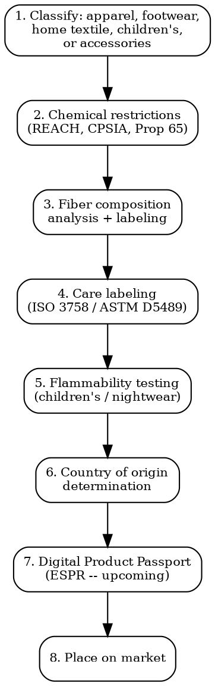

# Textile Compliance

Full regulatory workflow for textiles, apparel, footwear, and home textiles. Chemical safety, labeling, flammability, and sustainability obligations.

## Decision Flow



## Chemical Restrictions

### EU -- REACH Annex XVII for Textiles

Key restricted substances in textiles:

| Substance | REACH Entry | Limit | Applies To |
|-----------|-------------|-------|-----------|
| **Azo dyes** releasing listed amines | Entry 43 | 30 mg/kg per amine | All textiles with prolonged skin contact |
| **Nickel** (release rate) | Entry 27 | 0.5 ug/cm2/week | Metal accessories (buttons, rivets, zippers) in prolonged skin contact |
| **Chromium VI** | Entry 47 | 3 mg/kg | Leather articles |
| **DMF (dimethylformamide)** | Entry 15/17 | 0.1 mg/kg (articles) | Footwear, furniture |
| **Formaldehyde** | Entry 72 | 75 mg/kg | Textiles in direct prolonged skin contact |
| **PFAS** | Proposed restriction (ECHA) | Universal ban proposed; expect ~2027 | ALL textiles (waterproofing, stain resistance) |
| **Nonylphenol ethoxylates (NPE)** | Entry 46a | 0.01% (100 mg/kg) | Textiles that are washed in water |
| **Lead compounds** | Entry 63 | 0.05% by weight | Textile articles |

**ECHA SVHC Candidate List**: Check any chemical used in finishing/dyeing. If >0.1% w/w of article, must notify ECHA and inform buyers.

### US -- CPSIA + State Laws

| Requirement | Scope | Limit |
|-------------|-------|-------|
| **Lead in children's products** (CPSIA Sec. 101) | All children's products including textiles | 100 ppm total lead in substrate; 90 ppm in surface coatings |
| **Phthalates** (CPSIA Sec. 108) | Children's toys and child care articles | 8 phthalates banned >0.1%: DEHP, DBP, BBP, DINP, DIDP, DnOP, DPENP, DHEXP |
| **Flammability** (16 CFR 1610) | ALL clothing textiles | Class 1 (normal), Class 2 (intermediate), Class 3 (rapid/intense burning -- BANNED) |
| **Children's sleepwear** (16 CFR 1615/1616) | Sleepwear sizes 0-14 | Must be flame resistant OR tight-fitting |
| **California Prop 65** | Products sold in CA | Warning for lead, phthalates, PFAS, formaldehyde above safe harbor levels |

**Third-party testing**: CPSIA requires accredited third-party testing for children's products. CPSC-accepted labs only. Must issue Children's Product Certificate (CPC).

### Voluntary but Market-Required Certifications

| Certification | Focus | Cost | Duration |
|---------------|-------|------|----------|
| **OEKO-TEX Standard 100** | Chemical safety testing (100+ substances) across 4 product classes | EUR 1,000-3,000 per article + EUR 200-500/year renewal | 4-6 weeks testing |
| **GOTS (Global Organic Textile Standard)** | Organic fibers (min 70%) + environmental/social criteria through supply chain | EUR 2,000-5,000 initial audit + annual | 4-8 weeks |
| **Bluesign** | Chemical input management in manufacturing | Varies (factory-level certification) | 3-6 months |
| **GRS (Global Recycled Standard)** | Recycled content verification (min 20%) | EUR 1,500-4,000 audit | 4-8 weeks |

These are technically voluntary but major retailers (H&M, Zara/Inditex, Nike, Decathlon) require at least one for supplier qualification.

## Fiber Composition Labeling

### EU -- Regulation 1007/2011

- Must list ALL textile fibers by generic name in descending order of weight percentage
- Tolerances: general 3% manufacturing tolerance; "other fibers" allowed up to 2% (or 5% for carded fibers)
- Non-textile parts of animal origin must be declared: "Contains non-textile parts of animal origin" (e.g., leather patches, horn buttons)
- Language: official language(s) of the country of sale
- Can be on label, tag, or packaging

**Example**: `65% polyester, 30% cotton, 5% elastane`

### US -- Textile Fiber Products Identification Act (TFPIA)

- Same principle: fibers by generic name in descending order of percentage by weight
- Must include: fiber content, country of origin, manufacturer/importer RN (Registered Number) or name
- FTC enforces. Generic fiber names per FTC rules (16 CFR 303)
- Fibers <5%: must be listed as "other fiber" unless functionally significant

### Care Labeling

| Market | Standard | Symbols |
|--------|----------|---------|
| EU | ISO 3758 (Ginetex symbols) | Wash tub, triangle (bleach), iron, circle (professional care), square (drying) |
| US | ASTM D5489 (symbols optional) + 16 CFR 423 Care Labeling Rule | Written care instructions mandatory; symbols optional but if used must follow ASTM |
| Japan | JIS L 0001 (aligned with ISO 3758 since 2016) | ISO symbols |
| Canada | CAN/CGSB-86.1 | ISO 3758 symbols |
| China | GB/T 8685 | Based on ISO 3758 |

**US quirk**: Written care instructions are MANDATORY even if you include symbols. Must include washing, bleaching, drying, ironing, and warnings.

## Country of Origin

| Market | Rule | Consequence of Error |
|--------|------|---------------------|
| EU | Not mandatory on label for most textiles. BUT: Customs requires origin for duty calculation. Some member states have national rules |  Customs duty miscalculation, potential fines |
| US | Mandatory. "Made in [country]" on label per FTC + Customs (19 CFR 134). Rules of origin: "substantial transformation" test | FTC enforcement, customs seizure, penalties up to $10,000 per violation |
| UK | Mandatory for imported goods per trade description laws | Trading Standards enforcement |

**"Made in" determination**: Generally, the country where the last substantial transformation occurred. For textiles: where the fabric was cut and sewn (CMT). Not where the fabric was woven or dyed.

## EU Ecodesign for Sustainable Products Regulation (ESPR) -- Digital Product Passport

| Aspect | Detail |
|--------|--------|
| **Regulation** | (EU) 2024/1781 -- Ecodesign for Sustainable Products Regulation |
| **Digital Product Passport (DPP)** | QR code on garment linking to product data: materials, origin, repairability, recyclability, carbon footprint, supply chain |
| **Textiles timeline** | Delegated acts for textiles expected 2025-2026. DPP mandatory estimated **2027-2028** |
| **Requirements** | Durability (min wash cycles), recyclability design, fiber content accuracy, restricted substance compliance, recycled content disclosure |
| **Unsold goods ban** | Destruction of unsold textiles/footwear banned (phased from 2026 for large companies, 2030 for SMEs) |

## Fur and Animal Fiber Regulations

| Market | Regulation | Requirement |
|--------|-----------|-------------|
| EU | Textile Labelling Reg 1007/2011 | "Contains non-textile parts of animal origin" mandatory. No EU-wide fur ban yet; national bans in some member states |
| US | Fur Products Labeling Act | Species name, country of origin, "fur" or "faux fur" declaration. Dog/cat fur banned (Dog and Cat Fur Prohibition Enforcement Act) |
| UK | Fur farming banned; import of cat/dog/seal fur banned | Correct labeling of any remaining legal fur |

## China -- GB Standards

| Standard | Scope |
|----------|-------|
| **GB 18401** | National general safety technical code for textile products. 3 categories: A (infant), B (direct skin), C (non-direct skin). Limits on formaldehyde, pH, color fastness, azo dyes, odor |
| **GB/T 29862** | Fiber content labeling |
| **GB 31701** | Children's textile safety (stricter than GB 18401 Cat A) |
| **FZ/T 73020** | Knitted garments |

Products must pass GB 18401 testing to clear Chinese customs. Non-compliance = import refusal.

## Testing Cost Summary

| Test | Cost | Timeline |
|------|------|----------|
| Fiber composition analysis | EUR 100-300 | 3-5 days |
| REACH restricted substances (full panel) | EUR 500-2,000 | 1-2 weeks |
| Azo dye screening | EUR 150-400 | 3-5 days |
| Formaldehyde | EUR 50-150 | 1-3 days |
| pH value | EUR 30-80 | 1-2 days |
| Nickel release | EUR 100-250 | 3-5 days |
| Flammability (16 CFR 1610) | USD 200-500 | 3-5 days |
| Children's sleepwear flammability | USD 300-800 | 5-7 days |
| CPSIA lead + phthalates (children's) | USD 300-800 | 5-7 days |
| OEKO-TEX Standard 100 | EUR 1,000-3,000 | 4-6 weeks |
| Color fastness (washing, rubbing, perspiration, light) | EUR 200-600 | 3-7 days |
| GB 18401 full panel (China) | EUR 300-800 | 1-2 weeks |

## Common Mistakes

- **Ignoring REACH for textiles**: REACH applies to ALL articles, not just chemicals. Textiles with restricted substances above limits = non-compliant in EU.
- **US care label without written instructions**: Symbols alone are not sufficient in the US. Written instructions are mandatory under 16 CFR 423.
- **"Made in" for cut-and-sew**: If fabric is woven in China but cut and sewn in Portugal, origin is Portugal. But if only sewn (not cut) in Portugal, origin may still be China.
- **PFAS in waterproof textiles**: ECHA universal PFAS restriction is advancing. If using PFAS-based DWR (durable water repellent), plan migration to PFAS-free alternatives now.
- **Children's textiles in US without CPC**: Third-party testing at CPSC-accepted lab + Children's Product Certificate = mandatory. No CPC = illegal to sell.
- **OEKO-TEX as substitute for REACH**: OEKO-TEX testing covers many REACH substances but is not a legal substitute for REACH compliance. You still need REACH documentation.

## MCP Integration

```
mcp__claude_ai_Cleo_Insight__search_signals(q="PFAS textile", country="EU") — PFAS restriction timeline
mcp__claude_ai_Cleo_Insight__search_signals(q="REACH textile") — substance restriction updates
mcp__claude_ai_Cleo_Insight__get_regulation(id) — ESPR, REACH Annex XVII details
mcp__claude_ai_Cleo_Insight__list_regulations — track Digital Product Passport requirements
```
