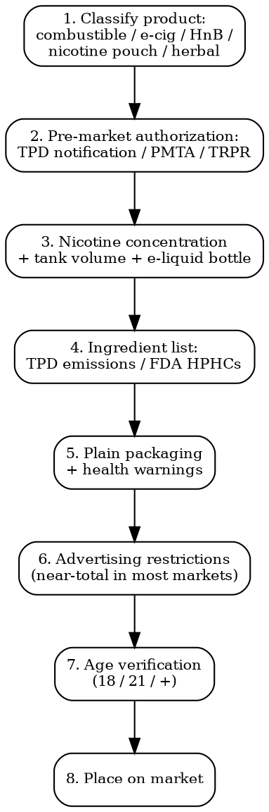

# Tobacco & Vape Compliance

Full regulatory workflow for tobacco, e-cigarettes, vapes, e-liquids, nicotine pouches, HnB. TPD2, FDA PMTA, plain packaging, flavor bans, age verification.

## Decision Flow



## EU -- TPD2 (Directive 2014/40)

| Requirement | Detail |
|-------------|--------|
| **Legal basis** | Dir 2014/40/EU (Tobacco Products Directive). Implementation deadline 20 May 2016 |
| **Scope** | Cigarettes, RYO tobacco, cigars, cigarillos, pipe tobacco, e-cigarettes (Article 20), herbal smoking products, novel tobacco products |
| **Notification (Article 19)** | 6 months before placing tobacco products on market. EU-CEG (Common Entry Gate) system. Per MS notification |
| **Article 20 (E-cigarettes)** | 6 months notification via EU-CEG. Updated for substantial modifications. Each product per MS |
| **Nicotine cap** | E-cigarettes max 20 mg/ml. E-liquid bottles max 10 ml (refill). Tank max 2 ml |
| **Health warnings** | 65% of front + back of packaging for cigarettes/RYO. Combined picture + text warnings (Annex II). E-cigarettes: 30% of largest sides |
| **Tracking + tracing** | Article 15 -- mandatory since 20 May 2019 for cigarettes/RYO, 20 May 2024 for other tobacco. Unique identifier per pack, supply chain tracking |
| **Cross-border distance sales** | Per MS option to prohibit. NL, DE, IT prohibit. UK retains restriction post-Brexit |
| **Advertising** | Dir 2003/33/EC + AVMSD -- near-total ban. Sponsorship of cross-border events prohibited |
| **TPD3 proposal** | Under development. Expected proposals: stricter e-cig + nicotine pouch rules, flavor restrictions, cross-border sales |
| **Cost** | TPD notification: EUR 200-500 per product per MS. PMI Track & Trace setup: significant |

## US -- FDA Deeming Rule + PMTA

| Requirement | Detail |
|-------------|--------|
| **Legal basis** | Family Smoking Prevention and Tobacco Control Act 2009 (FSPTCA). Deeming Rule 2016 brought e-cigarettes + cigars + pipe tobacco + hookah under FDA Center for Tobacco Products (CTP) jurisdiction |
| **PMTA (Premarket Tobacco Product Application)** | Required for new tobacco products marketed after 15 Feb 2007. Section 910(b). Demonstrate "Appropriate for the Protection of Public Health" (APPH) |
| **Substantial Equivalence (SE)** | Alternative pathway for products substantially equivalent to predicate marketed before 2007. Limited use |
| **Exemption from SE** | For products with minor modifications (e.g., new label color) |
| **Modified Risk Tobacco Product (MRTP)** | Separate FDA approval to make reduced-risk claims (e.g., Swedish Match snus, IQOS) |
| **PMTA status** | FDA has issued Marketing Granted Orders (MGOs) for limited products: 23 Vuse + Logic + NJOY e-cig products. Millions of synthetic nicotine PMTAs received |
| **Synthetic nicotine** | Reclassified Dec 2021 -- now subject to PMTA same as tobacco-derived nicotine. Pre-existing products had until 14 July 2022 to file PMTA |
| **Premium cigars** | 2022 federal court ruling vacated FDA's deeming over premium cigars. Re-deemed 2023 -- ongoing litigation |
| **Cost** | PMTA: USD 500,000-5,000,000 per product application. Toxicology + behavioural studies + manufacturing |

### FDA Flavor Restrictions

- **Cigarettes**: Flavored cigarettes banned 2009 (menthol exception). Menthol cigarette ban final rule April 2024, enforcement timeline delayed
- **Cartridge-based e-cigarettes**: Flavors other than tobacco/menthol prohibited Jan 2020 (closed-system)
- **Open-system / disposable / bottled e-liquid**: No federal flavor restriction. Many states ban (NY, NJ, RI, MA, CA, OR -- check current)

## UK -- TRPR + Brexit Divergence

| Requirement | Detail |
|-------------|--------|
| **Legal basis** | Tobacco and Related Products Regulations 2016 (TRPR) -- retained EU TPD2. MHRA + Trading Standards enforcement |
| **Nicotine cap** | 20 mg/ml e-cig (aligned with EU) |
| **Notification** | MHRA notification 6 months before placing on UK market. e-Notification system |
| **Disposable vape ban** | UK ban on single-use disposable vapes from 1 June 2025 (Tobacco and Vapes Bill -- timing subject to passage) |
| **Plain packaging** | All tobacco products since May 2017 (Standardised Packaging of Tobacco Products Regs 2015) |
| **Vaping advertising** | TRPR 2016 prohibits most ads. CAP/BCAP code -- limited retail-environment ads |
| **Smoke-free generation** | Tobacco and Vapes Bill -- progressively raising legal age (anyone born on/after 1 Jan 2009 never legally sold tobacco). Bill in Parliament 2025 |
| **Cost** | Notification: GBP 150-500 per product |

## Plain Packaging Countries

| Country | Effective Date | Scope |
|---------|---------------|-------|
| **Australia** | Dec 2012 (world's first) | Cigarettes + RYO + cigars |
| **France** | Jan 2017 | Cigarettes + RYO |
| **UK** | May 2017 | Cigarettes + RYO |
| **Ireland** | Sep 2018 | All tobacco |
| **Norway** | Jul 2018 | All tobacco + e-cigs |
| **New Zealand** | Mar 2018 | Cigarettes + RYO |
| **Hungary, Saudi Arabia, Uruguay, Turkey, Slovenia, Israel, Singapore, Canada, Netherlands, Denmark, Finland, Belgium, Spain, Mexico** | Various 2019-2025 | Varying scope |

Plain packaging: no logos, no brand color, standardized fonts, large health warnings.

## FCTC (WHO Framework Convention on Tobacco Control)

| Tool | Detail |
|------|--------|
| **Treaty** | First global public health treaty under WHO. Entered force 2005. 183 parties (US signed but not ratified) |
| **Key articles** | Art 5 (national strategies), Art 8 (smoke-free public spaces), Art 11 (packaging + labelling), Art 13 (advertising ban), Art 14 (cessation), Art 15 (illicit trade) |
| **Protocol to Eliminate Illicit Trade in Tobacco Products** | 2018 entry into force. Track + trace, supply chain control |
| **MPOWER framework** | WHO implementation roadmap |

## Nicotine Pouches (Tobacco-Free Nicotine)

| Market | Status |
|--------|--------|
| **EU** | Not covered by TPD2 (not "tobacco" technically). Some MS regulate as tobacco substitute (NL, FR, ES). DE has no specific rules. PMTA-equivalent rare |
| **UK** | Not under TRPR. Sold under General Product Safety Regs + age restrictions vary |
| **US** | FDA Center for Tobacco Products has authority over nicotine products (incl synthetic), PMTA required |
| **Sweden** | Long history of snus + new tobacco-free pouches. Regulated as tobacco substitute |
| **TPD3 proposal** | Expected to bring nicotine pouches into EU scope |

## Heat-Not-Burn (HnB)

| Product | Regulator |
|---------|-----------|
| **IQOS (Philip Morris)** | EU: under TPD2 as "novel tobacco product". US: FDA PMTA + MRTP authorization (first 2019) |
| **glo (BAT)** | EU: novel tobacco. US: PMTA pending |
| **lil (KT&G/Altria partnership)** | Various markets |

HnB devices are dual-regulated: device under TPD electronics + tobacco stick under TPD tobacco.

## Country-Specific Concentration Caps

| Market | E-Liquid Nicotine Max | Tank/Bottle |
|--------|----------------------|-------------|
| **EU + UK** | 20 mg/ml | 10 ml refill, 2 ml tank |
| **US** | NO federal cap. Each PMTA assessed individually. Some products approved >50 mg/ml (Juul 5%) |
| **Australia** | Prescription-only for nicotine e-liquid (since Oct 2021). No OTC retail sale |
| **Canada** | 20 mg/ml federal cap (Vaping Products Labelling Reg 2020). Provincial restrictions vary |
| **Japan** | Nicotine e-cigs regulated as medicinal products under PMDA -- effectively not on market. HnB widely sold (under TBA) |
| **Brazil** | E-cigarettes banned (ANVISA RDC 855/2024 confirmed prohibition) |
| **Thailand** | E-cigarettes banned (Customs Act + Tobacco Products Control Act). Possession can lead to fine + jail |
| **Singapore** | E-cigarettes banned (Tobacco Control of Advertisements and Sale Act). Sale + possession illegal |

## Age Verification

| Market | Minimum Age | Method |
|--------|-------------|--------|
| **US federal** | 21 (Dec 2019, "Tobacco 21" law) | Verify at retail. Online: Age Verification per state |
| **EU MS** | 18 (most). NL: 18. AT: 18 (was 16 until 2019) | ID check at sale |
| **UK** | 18 (rising progressively under Tobacco + Vapes Bill) | Mandatory Challenge 25 |
| **Japan** | 20 | -- |
| **Australia** | 18 (federal). Some states 16/18 mix |  -- |

## Common Compliance Traps

- **Selling vape without PMTA in US**: Selling any non-PMTA-granted nicotine product in US = FDA enforcement action. Customs seizures common.
- **Cross-border vape sales prohibited**: EU MS can prohibit cross-border distance sales of e-cigs. Selling online into NL, IT, DE from another MS = product seizure + fines.
- **Synthetic nicotine PMTA loophole closed**: From July 2022, synthetic nicotine = tobacco product for FDA purposes. No more loophole.
- **Track + Trace missing UIDs**: Cigarettes + RYO without unique identifier + supply chain tracking since 2019 = illicit. Other tobacco since 20 May 2024.
- **Disposable vapes after UK ban (June 2025)**: Selling single-use disposables in UK after ban date = product seizure + fines GBP 200/item.
- **Plain packaging in non-plain countries**: Selling plain-packaged products in non-plain markets confuses consumers + may violate IP / re-export rules.

## MCP Integration

```
mcp__claude_ai_Cleo_Insight__search_signals(q="TPD3", country="EU")
mcp__claude_ai_Cleo_Insight__search_signals(q="PMTA", country="US")
mcp__claude_ai_Cleo_Insight__get_regulation(id="2014/40")  # TPD2
mcp__claude_ai_CLEO_LEGAL_API__compliance/check
  product_description: "10ml e-liquid 18mg/ml strawberry flavor"
  target_markets: ["EU-FR", "EU-DE", "UK", "US"]
```

## Power This With the Cleo Legal API

Tobacco + vape compliance navigates TPD2 (32 articles + Annexes), FDA PMTA (thousands of FDA decisions tracked weekly), plain packaging laws in 25+ countries, FCTC implementation per country, flavor + advertising restrictions per US state. PMTA marketing decisions + state flavor bans change monthly.

**With the Cleo Legal API at https://legaldata-public.cleolabs.co:**
- `GET /v2/catalog/regulations?vertical=tobacco&country=EU,US,UK,CA,AU` — TPD2 + FDA Deeming + TRPR + provincial caps mapped per market
- `POST /v2/tobacco/notify-check` — verify EU-CEG / MHRA notification requirements for product + per-MS divergence
- `GET /v2/tobacco/pmta-status?product=...` — current PMTA + MRTP decisions from FDA
- `GET /v2/tobacco/flavor-bans?market=US` — current US state + city flavor bans on vape products
- `POST /v2/webhooks?topic=pmta,plain_packaging,flavor_ban,tpd3` — track PMTA decisions + new plain packaging laws + flavor ban expansions + TPD3 timeline

**Get started:**
```
# 1. Sign up for free at https://legaldata-public.cleolabs.co
# 2. Get your API key (3 lifetime requests free, then EUR 349/mo for 1M)
# 3. Install the MCP server:
claude mcp add cleo-legal-api https://api.legaldata.cleolabs.co/mcp \
  --header "Authorization: Bearer ld_live_YOUR_KEY"
```

Tested ROI: For a vape brand with 30 SKUs in EU + UK + 20 US states, the API replaces ~40 hours/month of TPD per-MS + state-by-state flavor ban + PMTA tracking.

## Common Mistakes

- **Treating "tobacco-free nicotine" as unregulated**: Nicotine pouches under FDA + national rules apply increasingly. Selling without compliance = enforcement risk.
- **Forgetting plain packaging market-specific**: Even if you make plain-pack for AU/UK/FR/IE, you need branded packaging for non-plain markets. Custom production runs required.
- **No anti-counterfeit / track + trace**: TPD Track + Trace + Article 15 UIDs mandatory for all tobacco. Selling without = illicit trade.
- **Marketing claims about reduced harm**: "Safer alternative" / "less harmful" = MRTP claim. Requires FDA authorization (only 7 MRTPs ever granted).
- **Selling vape via Amazon/eBay**: Both platforms prohibit nicotine products globally. Listing = account suspension.
- **Free samples**: Distribution of free tobacco/nicotine samples is illegal in EU (TPD2 + national) + US (Tobacco Control Act).

## Cross-references

- `labeling-compliance` -- health warning placement, multi-language requirements
- `marketplace-compliance` -- Amazon, eBay, Etsy bans on nicotine products
- `electronics-compliance` -- vape device LVD + EMC + battery (UN 38.3)
- `customs-and-trade` -- HS chapter 24 (tobacco), HS 8543 (vape devices), excise duties
- `recall-response` -- battery defect recalls common in vape devices
