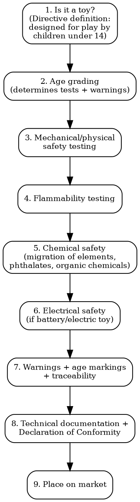

# Toy Compliance

Full regulatory workflow for toys and children's products. High-stakes category: non-compliance = immediate recall, heavy fines, criminal liability.

## Decision Flow

## Is It a Toy?

The EU Toy Safety Directive 2009/48/EC defines a toy as "a product designed or intended, whether or not exclusively, for use in play by children under 14 years of age."

**NOT toys** (explicitly excluded): decorative items, sporting equipment, bikes with seat height >435mm, puzzles >500 pieces, air guns, fireworks, slingshots, darts with metal tips, chemistry sets designed for education (not play), fashion jewelry for children, Christmas decorations.

**Gray area products**: If the product COULD be perceived as a toy by a reasonable consumer, treat it as a toy. Market surveillance authorities apply this test aggressively.

## EU -- Toy Safety Directive 2009/48/EC

### EN 71 Test Suite

| Standard | Scope | Key Tests | Cost |
|----------|-------|-----------|------|
| **EN 71-1** | Mechanical and physical | Small parts (choke hazard), sharp edges, sharp points, pull strength, drop test, torque test, bite test, projectiles, mouth-actuated toys | EUR 300-800 |
| **EN 71-2** | Flammability | Burning rate of materials (cellulose, textile, hair/pile, liquid-filled toys). Materials must not: flash, burn explosively, burn >30mm/s | EUR 200-400 |
| **EN 71-3** | Migration of certain elements | 19 elements tested in 3 categories (dry/liquid/scraped-off material). Limits per element per category. E.g., lead: 2.0/0.5/23 mg/kg | EUR 300-800 |
| **EN 71-4 to EN 71-8** | Chemistry sets, chemical toys other than chemistry sets, activity toys | Specific requirements for chemical experiments, cosmetic kits, etc. | EUR 200-500 each |
| **EN 71-9** | Organic chemical compounds | Flame retardants, primary aromatic amines, colorants, preservatives, plasticizers, solvents, wood preservatives | EUR 500-1,500 |
| **EN 71-10/11** | Organic chemical compounds | Sample preparation (71-10) and analytical methods (71-11) for EN 71-9 | Included in EN 71-9 testing |
| **EN 71-12** | N-Nitrosamines | N-nitrosamines and N-nitrosatable substances in toy materials intended to be placed in the mouth | EUR 200-400 |
| **EN 71-13** | Olfactory board games, cosmetic kits, gustative games | Fragrance allergens | EUR 200-400 |
| **EN 71-14** | Trampolines | Domestic trampolines for play | EUR 500-1,000 |
| **EN 62115** | Electric toys | Electrical safety for battery-operated and transformer-powered toys | EUR 500-1,500 |

**Full EN 71 suite cost**: EUR 800-2,000 (EN 71-1/2/3 minimum) up to EUR 3,000-5,000 (full suite including chemical tests).

### Proposed Revision (2023)

European Commission proposed revised Toy Safety Regulation (not yet adopted as of early 2026). Key changes expected:
- Digital safety requirements (connected toys, AI)
- Stricter chemical limits (endocrine disruptors)
- Digital Product Passport for toys
- Enhanced market surveillance powers

## US -- CPSIA + ASTM F963

### CPSIA Requirements for Toys

| Requirement | Limit/Rule |
|-------------|-----------|
| **Lead in substrate** (Section 101) | 100 ppm total lead content |
| **Lead in surface coatings** (Section 101) | 90 ppm |
| **Phthalates** (Section 108) | 8 phthalates permanently banned >0.1%: DEHP, DBP, BBP, DINP, DIDP, DnOP, DPENP, DHEXP |
| **Third-party testing** (Section 106) | MANDATORY. Must be tested at CPSC-accepted accredited lab. No self-testing |
| **Children's Product Certificate (CPC)** | Domestic manufacturer or importer must issue CPC based on third-party test results. Must cite applicable CPSC rules |
| **Tracking labels** | Permanent, distinguishing mark on product and packaging: manufacturer, production date, batch/model, location of production |

### ASTM F963 -- Standard Consumer Safety Specification for Toy Safety

| Test | Scope |
|------|-------|
| **Physical/mechanical** | Small parts (under-3), sharp edges, sharp points, pull/torque, projectiles, ride-on stability, cords/strings, battery accessibility |
| **Flammability** | Textiles, cellulosic materials (same principles as EN 71-2 but different test methods) |
| **Chemical** | Heavy metals (ASTM F963-specific soluble limits: antimony, arsenic, barium, cadmium, chromium, lead, mercury, selenium), total lead (CPSIA), phthalates (CPSIA) |
| **Electrical** | Battery-operated toys per UL 696 / ASTM F963 Clause 4.25. Max voltage, insulation, heat, abnormal operation |
| **Magnets** | Flux index >50 kG2mm2 must be inaccessible or too large to swallow (ASTM F963-23 strengthened magnet requirements) |

**Cost**: ASTM F963 full testing: USD 1,500-3,000. With CPSIA lead + phthalates: USD 2,000-4,000.

## UK -- Toy (Safety) Regulations 2011

Mirrors EU Toy Safety Directive. Currently still aligned with EN 71 standards.

| Requirement | Detail |
|-------------|--------|
| **Conformity marking** | UKCA required (extended CE acceptance period -- check current OPSS guidance) |
| **UK Authorised Representative** | Required if manufacturer is outside UK |
| **Standards** | BS EN 71 series (identical to EN 71 for now) |
| **Notified Body** | UK Approved Body if third-party assessment is needed |

## China -- GB 6675 + CCC

| Requirement | Detail |
|-------------|--------|
| **GB 6675** | Mandatory national standard for toys. 4 parts: basic norms, mechanical/physical, flammability, chemical (migration of elements). Broadly aligned with EN 71 |
| **CCC certification** | Mandatory for: electric toys, plastic toys, metal toys, ride-on toys, projectile toys, dolls. NOT all toys -- check CCC catalogue |
| **CCC process** | Application -> factory inspection -> type testing at designated lab -> certificate. Timeline: 2-4 months. Cost: CNY 30,000-80,000 |

## Japan -- ST Mark

| Requirement | Detail |
|-------------|--------|
| **ST Mark** | Voluntary certification by Japan Toy Association. Not legally required but ALL major Japanese retailers require it |
| **ST 2016** | Test standard (aligned with ISO 8124). Mechanical, flammability, chemical |
| **Food Sanitation Act** | Toys for children under 6 intended to be placed in the mouth must also comply (chemical migration limits for food contact) |
| **Cost** | JPY 100,000-500,000 per product |

## Age Grading

### Determining Age Grade

| Source | Application |
|--------|-------------|
| **CPSC Age Determination Guidelines** | US reference document. Analyzes toy features: complexity, skill required, size of components, interest appeal |
| **ISO 8124-1 Annex A** | International guidance on age grading |
| **CEN TR 13387** (EU) | Guidance on age warnings for toys |

**Critical thresholds**:
- **Under 3**: No small parts (fails EN 71-1 small parts cylinder test), no small balls, no balloons in packaging, strictest chemical limits
- **Under 6**: Food Sanitation Act (Japan), stricter supervision assumption
- **Under 8**: Magnet hazard warnings mandatory, chemistry set restrictions per EN 71-4
- **Under 14**: Upper limit of toy definition in EU

### Warning Labels Per Market

| Market | Under-3 Warning | Format |
|--------|-----------------|--------|
| EU | "Warning: Not suitable for children under 36 months" + reason (e.g., "small parts -- choking hazard") | On product and packaging. Min 5mm font. Preceded by "Warning" or warning triangle |
| US | "WARNING: CHOKING HAZARD -- Small parts. Not for children under 3 years." | Specific wording per CPSC. Must use all-caps "WARNING" |
| UK | Same as EU | Same format |
| China | GB 5296.5: age warning + hazard description in Chinese | Chinese language, specific format |

## Chemical Restrictions Summary (Cross-Market)

| Substance | EU (EN 71-3/9) | US (CPSIA/ASTM F963) |
|-----------|-----------------|----------------------|
| Lead (total) | Migration limits per material type | 100 ppm total content (CPSIA) |
| Lead (surface coating) | Migration limits | 90 ppm (CPSIA) |
| Cadmium | Migration: 1.3/0.3/17 mg/kg | Soluble: 75 mg/kg (ASTM F963) |
| Phthalates | REACH + Toy Safety Directive | 8 phthalates banned >0.1% (CPSIA) |
| Chromium VI | Migration limits | Soluble limits (ASTM F963) |
| BPA | Restricted in toys for under-3 (EU) | Some state restrictions (not federal) |
| Flame retardants | EN 71-9 limits on specific FRs | No federal toy-specific limits (state: CA, WA restrict certain FRs) |

## Common Mistakes

- **Age grading to avoid testing**: Setting age 14+ to escape toy regulations does not work if the product is obviously designed for younger children. Authorities use the "reasonable foreseeability" test.
- **Importing without CPC**: The US importer must issue the Children's Product Certificate. The foreign manufacturer cannot issue it on the importer's behalf.
- **EN 71-3 only**: EN 71-3 tests migration of elements. EN 71-9 tests organic chemicals (flame retardants, phthalates, preservatives). Both are needed for comprehensive chemical safety.
- **Missing tracking labels**: CPSIA requires permanent marks on the product itself (not just packaging): manufacturer, date, batch. Omission = violation.
- **China CCC scope**: Not all toys need CCC. Check the CCC compulsory product catalogue. But ALL toys need GB 6675 compliance.
- **Connected/smart toys**: Toys with cameras, microphones, or internet connectivity must also comply with GDPR/COPPA and upcoming EU CRA. Data protection is part of toy safety now.
