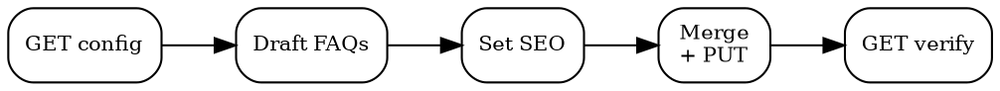

# Trust Center

## Quick Reference

| Action | MCP Tool | Detail |
|--------|----------|--------|
| Read config | `mcp__bastion__get-trust-center-config` | Full current state |
| Update config | `mcp__bastion__put-trust-center` | Replaces entire config |
| List policies | `mcp__bastion__list-customer-policies` | Link public-facing summaries |
| Framework stats | `mcp__bastion__get-frameworks-stats` | Certification progress |

## Setup Flow



## Update Protocol

**PUT replaces entire config.** Omitting a field deletes it. Always GET first, merge changes, PUT full payload, GET to verify.

## FAQ Template

| Q | Answer guidance |
|---|-----------------|
| Data encryption? | AES-256 at rest, TLS 1.3 in transit. Name provider. |
| Access control? | RBAC, MFA, least-privilege, quarterly reviews. |
| Incident response? | Detection < 1h, containment < 4h, GDPR Art. 33 (72h). |
| Employee training? | Onboarding + annual refresher + phishing sims. |
| Certifications? | Active certs with dates. Use `get-frameworks-stats`. |
| Data retention? | Period + deletion process. Ref `policy-management`. |
| Vendor management? | Due diligence, annual review, DPA required. |
| Business continuity? | RTO/RPO targets, quarterly failover tests. |
| Penetration testing? | Annual third-party. Share date, not report. |
| Privacy rights? | Contact email, DSAR, 30-day response. |

Answers support **markdown**. 2-4 sentences. Link excerpts, never full policies.

## SEO

- **title**: "[Company] Trust Center"
- **description**: Include "security", "compliance", "data protection"
- **keywords**: `ISO 27001, SOC 2, GDPR, trust center, security compliance, data protection, encryption, access control`
- Framework names are high-intent: "ISO 27001 certified", "SOC 2 compliant"

## Workflow

1. **Audit** -- `mcp__bastion__get-trust-center-config`. Published? FAQ count? SEO set?
2. **Content** -- FAQ template above. Verify answers against `policy-management`.
3. **SEO** -- Title + description + keywords.
4. **Style** -- `background_color` hex. Light preferred.
5. **Publish** -- Enable, verify URL.
6. **Maintain** -- Update on new certs (`compliance-reporting`), policy changes.

## Usage Example

```
mcp__bastion__get-trust-center-config  # → {published: false, faqs: [], seo: {}}
mcp__bastion__put-trust-center(config={published: true, faqs: [...], seo: {...}, background_color: "#F8F9FA"})
mcp__bastion__get-trust-center-config  # → verify
```

## Common Mistakes

- **PUT without GET** -- Partial update overwrites entire config. Always read-modify-write.
- **Linking full policy documents** -- Trust center is public. Link summaries only, never internal policies.
- **Stale cert claims** -- Expired ISO 27001 or old SOC 2 report = liability. Check dates via `mcp__bastion__get-frameworks-stats`.
- **Generic answers** -- "We take security seriously" is meaningless. State specific controls: "AES-256, TLS 1.3, MFA enforced."
- **Missing SEO keywords** -- Prospects search "ISO 27001 trust center" not your company name. Include framework names.
