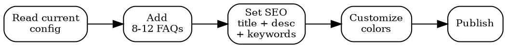

# Trust Center

## Quick Reference

| Action | MCP Tool | Fallback |
|--------|----------|----------|
| Read current config | `bastion__get-trust-center-config` | Check trust center URL directly |
| Update config | `bastion__put-trust-center` | Update via Bastion UI |
| Check linked policies | `bastion__list-customer-policies` | Review policy inventory |
| Get framework status | `bastion__get-frameworks-stats` | Audit dashboard |

## Setup Flow

## Update Protocol

**Always read before writing.** `put-trust-center` replaces the config. Omitting a field can unpublish your center or delete FAQs.

1. `get-trust-center-config` — capture full current state
2. Modify only the fields you need to change
3. Preserve all other fields in the PUT payload
4. Verify after update with another GET

## FAQ Topics (target 8-12)

Data handling, encryption, access control, incident response, certifications, compliance frameworks, vendor management, data retention, backup & recovery, employee training, penetration testing, privacy rights.

FAQ answers support **markdown**. Keep 2-4 sentences each. Link policy excerpts, never full text.

## SEO Configuration

| Field | Guidance |
|-------|----------|
| **title** | "[Company] Trust Center" or "[Company] Security & Compliance" |
| **description** | 1-2 sentences, include "security", "compliance", "data protection" |
| **keywords** | Mix of: brand terms, framework names (ISO 27001, SOC 2, GDPR), domain terms (trust center, security, compliance, data protection) |

## Workflow

1. **Audit** — Read config. Published or draft? FAQ count? SEO set?
2. **Content** — Draft all FAQs. Verify each answer against actual policies.
3. **SEO** — Set title, description, keywords targeting prospect search terms.
4. **Style** — `background_color` hex value matching brand. Light backgrounds preferred.
5. **Publish** — Enable, verify public URL renders.
6. **Maintain** — Update on policy changes, new certs, or framework additions.

## Common Mistakes

- **PUT without GET** — Partial updates overwrite the entire config. Always read first, merge changes, then write.
- **Linking full policy text** — Trust center is public. Link to summaries or excerpts, never the full internal policy document.
- **Stale certification claims** — If your ISO 27001 cert expired or SOC 2 report is from 2 years ago, update or remove the claim.
- **Generic answers** — "We take security seriously" is meaningless. State specific controls: "AES-256 at rest, TLS 1.3 in transit, MFA enforced for all employees."
- **Publishing before review** — Have someone outside the security team read the FAQs. If they can't understand the answers, rewrite them.
